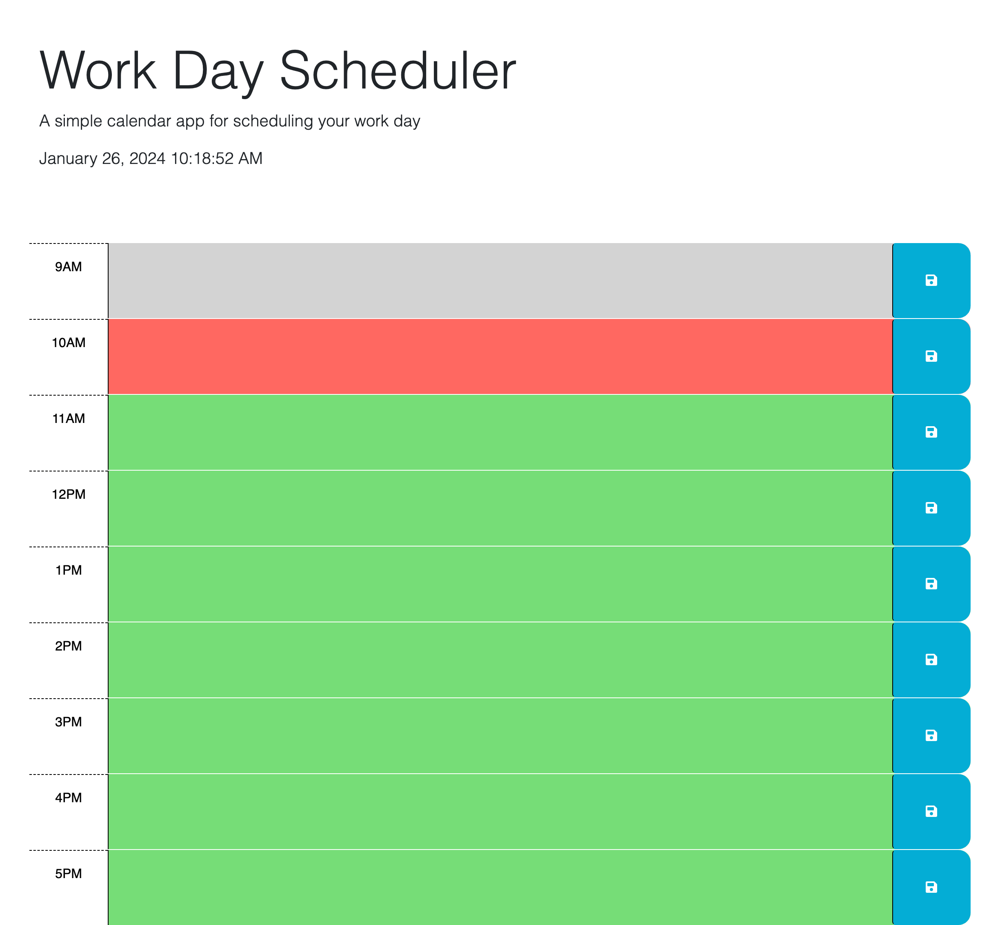

# daily-planner

https://github.com/cassidykovell/daily-planner.git

## Description

This is a daily planner that uncludes the times in a workday.

## Installation
No notes for installation.

## Usage
To use this website select a time in which you want to write a to-do, type out the 'to-do' and click the save button. Upon clicking the save button that 'to-do' will be saved to that time block and will appear even upon reloading the page. The webpage also displays the date and time and the time blocks are color coded to denote times that are in the past, the present, and future. Grey denoting past times, red denoting the present, and green denoting the future. 

## Credits
Help from my TA in office hours and the Xpert Learning Assistant.

## License

## Badges

## Features
A dayjs run clock, time blocks thay display the hours in a work day, an area for text, and save buttons to save the text to those time blocks.

## How to Contribute

## Tests